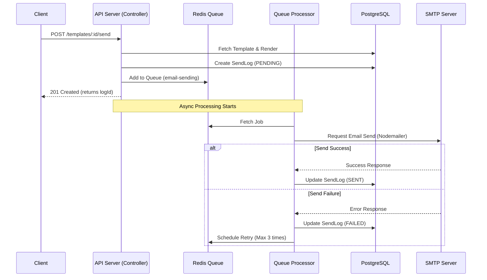

# Email Sending Process Guide

This document explains the entire process from calling the email sending API to the actual delivery of the email to the recipient in the Jamail service.

## 1. Flowchart



## 2. API Usage

### Endpoint
- **URL**: `POST /api/templates/:id/send`
- **Auth**: Bearer Token (JWT) or API Key required
- **Permission**: `Operator` role or higher, `send_email` scope required

### Request Body

```json
{
  "recipient": "user@example.com",
  "variables": {
    "name": "John Doe",
    "verificationCode": "123456"
  },
  "scheduledAt": "2024-12-25T09:00:00Z" // Optional (for scheduled sending)
}
```

- `recipient`: Recipient's email address (Required)
- `variables`: Data to replace variables (e.g., `{{name}}`) in the template (Optional)
- `scheduledAt`: Scheduled time for sending (ISO 8601 format, Optional)

### Response

```json
{
  "message": "Email queued for delivery",
  "logId": "uuid-string-1234"
}
```

## 3. Internal Process Details

### Step 1: Request Handling & Rendering (`TemplatesController`)
- Upon receiving an API request, the system fetches the template by ID from the DB.
- Renders the template subject and body (HTML) using the provided `variables`.
- Creates a log in the `SendLog` table with an initial status of `PENDING`.

### Step 2: Queue Registration (`BullMQ`)
- Registers the rendered content and recipient information as a Job in the `email-sending` queue.
- Returns a success response to the client immediately at this point. (Non-blocking)

### Step 3: Job Processing (`EmailProcessor`)
- A background worker fetches the job from the queue.
- Calls `MailService` to attempt the actual sending.

### Step 4: SMTP Sending (`MailService`)
- Automatically selects the appropriate SMTP configuration based on the template's category. (Load balancing or specific category assignment)
- Sends the email to the external SMTP server using `Nodemailer`.

### Step 5: Result Handling
- **Success**: Updates `SendLog` status to `SENT` and saves the SMTP response.
- **Failure**: Updates `SendLog` status to `FAILED` and records the error reason. Automatic retries may be performed based on BullMQ configuration.

## 4. Troubleshooting

### If Email is Not Received

1. **Check API Response**: Ensure you received a `logId`.
2. **Check Logs**: Verify the status of the `logId` in the `SendLog` table.
   - `PENDING`: Waiting in queue or currently processing.
   - `FAILED`: Sending failed. Check the `errorReason` column.
3. **Check SMTP Config**: Verify that the registered SMTP server credentials are correct.
4. **Check Spam Folder**: Check the recipient's spam folder.
