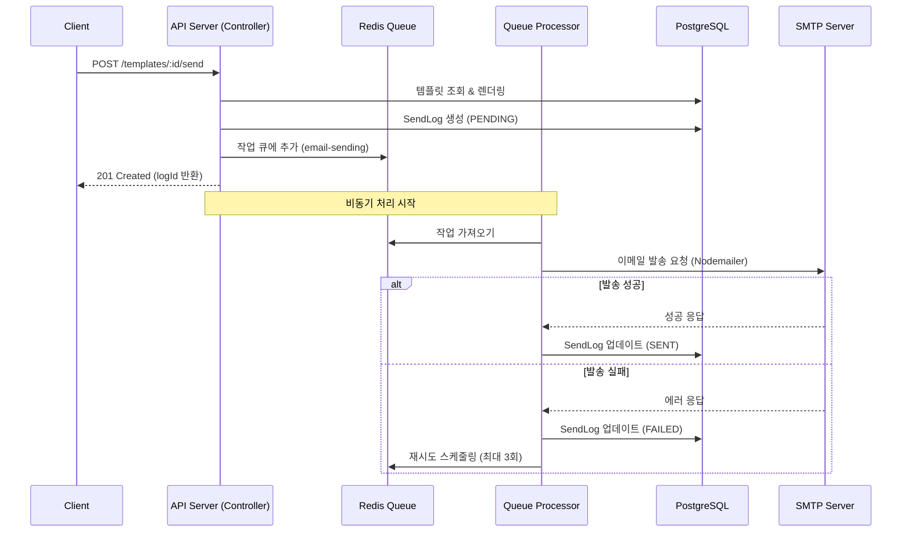

# 이메일 발송 프로세스 가이드

이 문서는 Jamail 서비스에서 이메일 발송 API를 호출하여 실제 수신자에게 메일이 전달되기까지의 전체 과정을 설명합니다.

## 1. 발송 흐름도 (Flowchart)



## 2. API 사용 방법

### 엔드포인트
- **URL**: `POST /api/templates/:id/send`
- **인증**: Bearer Token (JWT) 또는 API Key 필요
- **권한**: `Operator` 이상, `send_email` 스코프 필요

### 요청 본문 (Request Body)

```json
{
  "recipient": "user@example.com",
  "variables": {
    "name": "홍길동",
    "verificationCode": "123456"
  },
  "scheduledAt": "2024-12-25T09:00:00Z" // 선택 사항 (예약 발송 시)
}
```

- `recipient`: 수신자 이메일 주소 (필수)
- `variables`: 템플릿 내 변수(`{{name}}` 등)를 치환할 데이터 (선택)
- `scheduledAt`: 발송 예약 시간 (ISO 8601 형식, 선택)

### 응답 (Response)

```json
{
  "message": "Email queued for delivery",
  "logId": "uuid-string-1234"
}
```

## 3. 내부 처리 과정 상세

### 1단계: 요청 접수 및 렌더링 (`TemplatesController`)
- API 요청이 들어오면 해당 ID의 템플릿을 DB에서 조회합니다.
- 요청받은 `variables`를 사용하여 템플릿의 제목과 본문(HTML)을 렌더링합니다.
- `SendLog` 테이블에 초기 상태(`PENDING`)로 로그를 생성합니다.

### 2단계: 큐 등록 (`BullMQ`)
- 렌더링된 결과와 수신자 정보를 `email-sending` 큐에 작업(Job)으로 등록합니다.
- 이 시점에서 클라이언트에게는 성공 응답을 반환합니다. (Non-blocking)

### 3단계: 작업 처리 (`EmailProcessor`)
- 백그라운드 워커가 큐에서 작업을 가져옵니다.
- `MailService`를 호출하여 실제 발송을 시도합니다.

### 4단계: SMTP 발송 (`MailService`)
- 템플릿의 카테고리에 맞는 SMTP 설정을 자동으로 선택합니다. (로드 밸런싱 또는 카테고리 지정)
- `Nodemailer`를 사용하여 외부 SMTP 서버로 메일을 전송합니다.

### 5단계: 결과 처리
- **성공 시**: `SendLog` 상태를 `SENT`로 업데이트하고 SMTP 응답을 저장합니다.
- **실패 시**: `SendLog` 상태를 `FAILED`로 업데이트하고 에러 원인을 기록합니다. BullMQ 설정에 따라 자동으로 재시도(Retry)가 수행될 수 있습니다.

## 4. 문제 해결 (Troubleshooting)

### 메일이 도착하지 않는 경우

1. **API 응답 확인**: `logId`를 받았는지 확인합니다.
2. **로그 조회**: `SendLog` 테이블에서 해당 `logId`의 상태(`status`)를 확인합니다.
   - `PENDING`: 큐에서 대기 중이거나 처리 중입니다.
   - `FAILED`: 발송에 실패했습니다. `errorReason` 컬럼을 확인하세요.
3. **SMTP 설정 확인**: 등록된 SMTP 서버의 연결 정보가 올바른지 확인합니다.
4. **스팸 함 확인**: 수신자의 스팸 메일함을 확인합니다.
