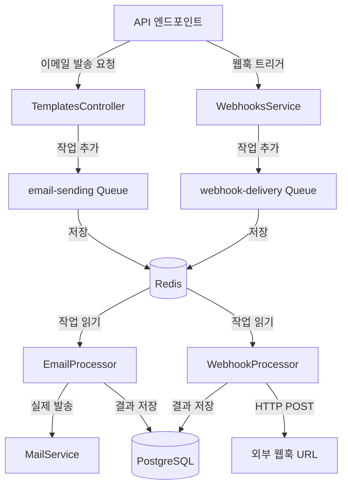

# Redis 역할 및 기능 가이드

## 개요

본 서비스(Jamail)에서 **Redis**는 **비동기 작업 큐 시스템의 백엔드 스토어**로 사용됩니다. Redis는 메모리 기반의 빠른 데이터 저장소로, [BullMQ](https://docs.bullmq.io/) 라이브러리와 함께 사용되어 이메일 발송 및 웹훅 전달과 같은 백그라운드 작업을 안정적으로 처리합니다.

## Redis의 주요 역할

### 1. 작업 큐 관리 (Job Queue Management)

Redis는 두 개의 핵심 작업 큐를 관리합니다:

#### 📧 이메일 발송 큐 (`email-sending`)
- **목적**: 이메일 발송 작업을 비동기로 처리
- **구현 위치**: [`queue/email.processor.ts`](file:///c:/Users/USER/projects/jamail/apps/api/src/queue/email.processor.ts)
- **주요 기능**:
  - 템플릿 기반 이메일 발송 처리
  - 발송 성공/실패 로그 기록 (SendLog 테이블)
  - 실패 시 자동 재시도 (최대 3회)
  - 지수 백오프(Exponential Backoff) 지원 (1초 → 2초 → 4초...)

#### 🔗 웹훅 전달 큐 (`webhook-delivery`)
- **목적**: 웹훅 이벤트를 외부 서비스로 전달
- **구현 위치**: [`webhooks/webhook.processor.ts`](file:///c:/Users/USER/projects/jamail/apps/api/src/webhooks/webhook.processor.ts)
- **주요 기능**:
  - 이벤트 기반 웹훅 전달 (예: 이메일 발송 완료, 템플릿 생성 등)
  - HMAC SHA256 서명을 통한 보안 인증
  - 실패 시 최대 3회 재시도 (1분 → 5분 → 15분 간격)
  - 전달 이력 및 응답 코드 저장

---

## 아키텍처



### 작업 흐름

1. **작업 추가**: API 요청이 들어오면 작업이 Redis 큐에 추가됩니다
2. **작업 저장**: Redis가 작업 데이터를 메모리에 저장하고 필요시 디스크에 백업합니다
3. **작업 처리**: Worker 프로세스가 Redis에서 작업을 가져와 처리합니다
4. **재시도 관리**: 작업 실패 시 Redis가 재시도 스케줄을 관리합니다
5. **결과 기록**: 최종 결과는 PostgreSQL에 영구 저장됩니다

---

## 주요 기능

### ✅ 작업 신뢰성 보장

#### 재시도 로직
- **이메일 큐**: 지수 백오프로 최대 3회 재시도
- **웹훅 큐**: 고정 간격(1분, 5분, 15분)으로 최대 3회 재시도

#### 데이터 영속성
- Redis는 메모리 기반이지만, AOF(Append Only File) 또는 RDB 스냅샷을 통해 디스크에 백업 가능
- Docker 볼륨(`redis_data`)을 통해 데이터 유실 방지

### ⚡ 성능 최적화

#### 비동기 처리
```typescript
// 사용자 요청이 즉시 완료되며, 실제 작업은 백그라운드에서 처리
await this.emailQueue.add('send-email', {
    templateId,
    recipient,
    subject,
    html,
    logId,
    category,
});

return { message: 'Email queued for delivery', logId };
```

#### 메모리 기반 속도
- Redis의 인메모리 특성으로 밀리초 단위의 빠른 작업 추가/조회
- 높은 처리량(Throughput) 지원

### 📊 작업 모니터링

BullMQ는 Redis를 통해 다음 정보를 제공합니다:
- 대기 중인 작업 수 (Waiting)
- 진행 중인 작업 (Active)
- 완료된 작업 (Completed)
- 실패한 작업 (Failed)
- 지연된 작업 (Delayed)

---

## 설정 및 구성

### 환경 변수

**파일**: [`apps/api/.env`](file:///c:/Users/USER/projects/jamail/apps/api/.env)

```env
REDIS_HOST='localhost'
REDIS_PORT=6379
```

### Docker Compose 설정

**파일**: [`docker-compose.yml`](file:///c:/Users/USER/projects/jamail/docker-compose.yml)

```yaml
redis:
  image: redis:7-alpine
  ports:
    - "6379:6379"
  volumes:
    - redis_data:/data
```

- **이미지**: Redis 7 (Alpine Linux 기반으로 경량화)
- **포트**: 6379 (Redis 기본 포트)
- **볼륨**: 데이터 영속성을 위한 볼륨 마운트

### BullMQ 연결 설정

**파일**: [`queue/queue.module.ts`](file:///c:/Users/USER/projects/jamail/apps/api/src/queue/queue.module.ts)

```typescript
BullModule.forRoot({
    connection: {
        host: process.env.REDIS_HOST || 'localhost',
        port: parseInt(process.env.REDIS_PORT || '6379'),
    },
})
```

### 큐별 설정

#### 이메일 발송 큐
```typescript
BullModule.registerQueue({
    name: 'email-sending',
    defaultJobOptions: {
        attempts: 3,                    // 최대 3회 재시도
        backoff: {
            type: 'exponential',        // 지수 백오프
            delay: 1000,                // 초기 지연 1초
        },
    },
})
```

#### 웹훅 전달 큐
```typescript
BullModule.registerQueue({
    name: 'webhook-delivery',
    // WebhookProcessor에서 커스텀 재시도 로직 구현
})
```

---

## 운영 가이드

### 로컬 개발 환경

1. **Redis 시작**:
```bash
docker-compose up -d redis
```

2. **연결 확인**:
```bash
docker exec -it jamail-redis-1 redis-cli ping
# 응답: PONG
```

3. **큐 상태 확인**:
```bash
# Redis CLI 접속
docker exec -it jamail-redis-1 redis-cli

# 모든 키 조회
KEYS *

# 특정 큐의 대기 작업 수 확인
LLEN bull:email-sending:wait
LLEN bull:webhook-delivery:wait
```

### 프로덕션 환경 권장 사항

#### 🔒 보안
- Redis 비밀번호 설정 (`requirepass` 옵션)
- 네트워크 격리 (VPC 내부에서만 접근 가능하도록 설정)
- 포트 외부 노출 금지 (Docker Compose의 `ports` 제거)

#### 📈 성능 튜닝
- **메모리 제한 설정**:
```yaml
redis:
  image: redis:7-alpine
  command: redis-server --maxmemory 512mb --maxmemory-policy allkeys-lru
```

- **영속성 전략 선택**:
  - **AOF (Append Only File)**: 데이터 손실 최소화 (권장)
  - **RDB Snapshot**: 디스크 공간 절약

```yaml
redis:
  command: redis-server --appendonly yes --appendfsync everysec
```

#### 🎯 모니터링

**Redis 메트릭 확인**:
```bash
docker exec -it jamail-redis-1 redis-cli INFO stats
```

주요 메트릭:
- `total_commands_processed`: 처리된 명령 수
- `used_memory_human`: 메모리 사용량
- `connected_clients`: 연결된 클라이언트 수

### 문제 해결

#### 작업이 처리되지 않을 때

1. **Redis 연결 확인**:
```bash
# API 로그에서 Redis 연결 에러 확인
docker logs jamail-api-1 | grep -i redis
```

2. **큐에 작업이 쌓여있는지 확인**:
```bash
docker exec -it jamail-redis-1 redis-cli LLEN bull:email-sending:wait
```

3. **Worker 프로세스 확인**:
   - `EmailProcessor`와 `WebhookProcessor`가 정상 실행 중인지 확인
   - API 서버 재시작: `npm run start:dev`

#### 메모리 부족

Redis가 메모리 제한에 도달하면 새 작업을 추가할 수 없습니다.

**해결 방법**:
- 완료된 작업 정리: BullMQ는 기본적으로 완료된 작업을 일정 시간 후 삭제
- `maxmemory-policy` 설정으로 자동 삭제 정책 적용
- Redis 메모리 제한 증가

---

## 의존성

### npm 패키지

**파일**: [`apps/api/package.json`](file:///c:/Users/USER/projects/jamail/apps/api/package.json)

```json
{
  "@nestjs/bullmq": "^10.x",  // NestJS BullMQ 통합
  "bullmq": "^5.x",           // 작업 큐 라이브러리
  "ioredis": "^5.8.2"         // Redis 클라이언트
}
```

- **BullMQ**: Redis 기반의 강력한 작업 큐 시스템
- **ioredis**: 고성능 Node.js Redis 클라이언트

---

## 코드 참조

### 핵심 파일

| 파일 | 역할 |
|------|------|
| [`queue/queue.module.ts`](file:///c:/Users/USER/projects/jamail/apps/api/src/queue/queue.module.ts) | BullMQ 및 Redis 연결 설정 |
| [`queue/email.processor.ts`](file:///c:/Users/USER/projects/jamail/apps/api/src/queue/email.processor.ts) | 이메일 발송 작업 처리 |
| [`webhooks/webhooks.module.ts`](file:///c:/Users/USER/projects/jamail/apps/api/src/webhooks/webhooks.module.ts) | 웹훅 큐 등록 |
| [`webhooks/webhook.processor.ts`](file:///c:/Users/USER/projects/jamail/apps/api/src/webhooks/webhook.processor.ts) | 웹훅 전달 작업 처리 |
| [`webhooks/webhooks.service.ts`](file:///c:/Users/USER/projects/jamail/apps/api/src/webhooks/webhooks.service.ts) | 웹훅 트리거 및 큐 추가 |

### 작업 추가 예시

**이메일 큐에 작업 추가**:
```typescript
// templates.controller.ts에서
await this.emailQueue.add('send-email', {
    templateId: id,
    recipient: sendDto.recipient,
    subject: renderedSubject,
    html: renderedHtml,
    logId: log.id,
    category: template.category,
});
```

**웹훅 큐에 작업 추가**:
```typescript
// webhooks.service.ts에서
await this.webhookQueue.add('deliver-webhook', {
    deliveryId: delivery.id,
    webhookId: webhook.id,
    url: webhook.url,
    secret: webhook.secret,
    event: 'email.sent',
    payload: eventPayload,
});
```

---

## 요약

> **Redis는 Jamail 서비스의 비동기 작업 처리 엔진입니다.**

- ✅ **신뢰성**: 자동 재시도 및 실패 처리
- ⚡ **성능**: 메모리 기반의 빠른 작업 처리
- 📦 **영속성**: 볼륨 마운트를 통한 데이터 보존
- 🔧 **확장성**: 필요시 Redis Cluster로 확장 가능

Redis 없이는 이메일 발송 및 웹훅 전달이 동기적으로 처리되어 API 응답 속도가 느려지고, 실패 시 재시도 메커니즘이 작동하지 않습니다. 따라서 Redis는 **서비스의 핵심 인프라 컴포넌트**입니다.
